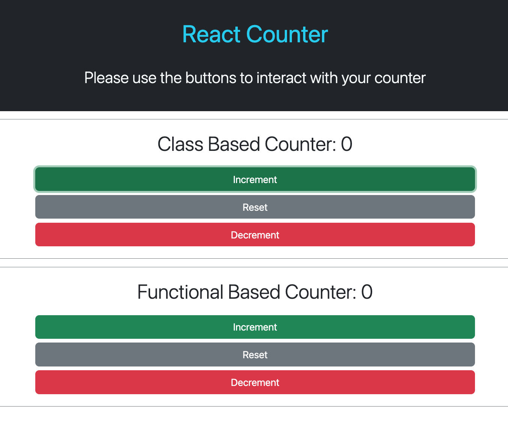
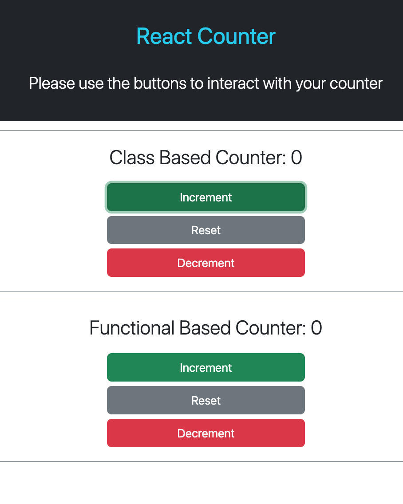

# Counter App

This interactive app allows the user to increment, reset and decrement counter values. App created to show an example of using Function and Class Components and a useState hook in React.

Please click here to view [deployed App URL](https://counter-app-react-sigma.vercel.app/).

## User Story

```md
> As a user I want to be increase a counter value, decrease a counter value up to 0, and reset a counter value to 0.
```

## Acceptance Criteria

> Must contain class based counter and a function based counter.

> Must contain a banner on the top of the page with a title of "React Counter" and a sub-title of "Please use the buttons to interact with your counter".

> The counter value must be displayed as `Counter: 0` on initial load in the counter section.

> The counter value must increase the current count value by 1 when the user clicks on the "Increment" button.

> The counter value must decrease the current count value by 1 when the user clicks on the "Decrement" button.

> The counter value must reset the current count value to 0 when the user clicks on the "Reset" button.

> The counter value must not decrement the current value below `0` (no negative values for the counter).

## Technologies

This project implements a variety of technologies:

> React.JS
> Bootstrap
> HTML & CSS
> JavaScript

## Screenshots & Video

### Video

https://github.com/GreenCatInForest/counter-app/assets/104716078/7a1f0634-8347-4c88-b249-6a6ef375c450


### Desktop viewport


### Mobile viewport



## Conclusion

To conclude, this was a enjoyable project to show how class and functional components and useState hook works in React. I believe the project meets the brief that I set out to create and we have developed the coding skills and knowledge.

Thank you! 
Yana
